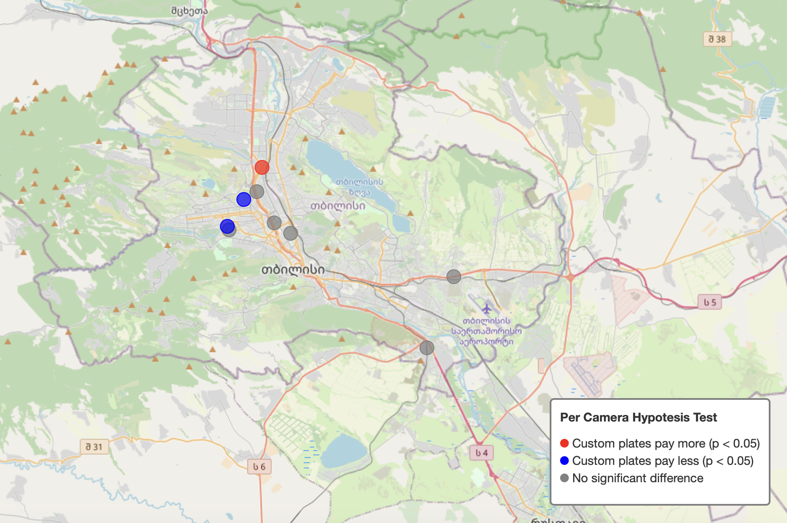
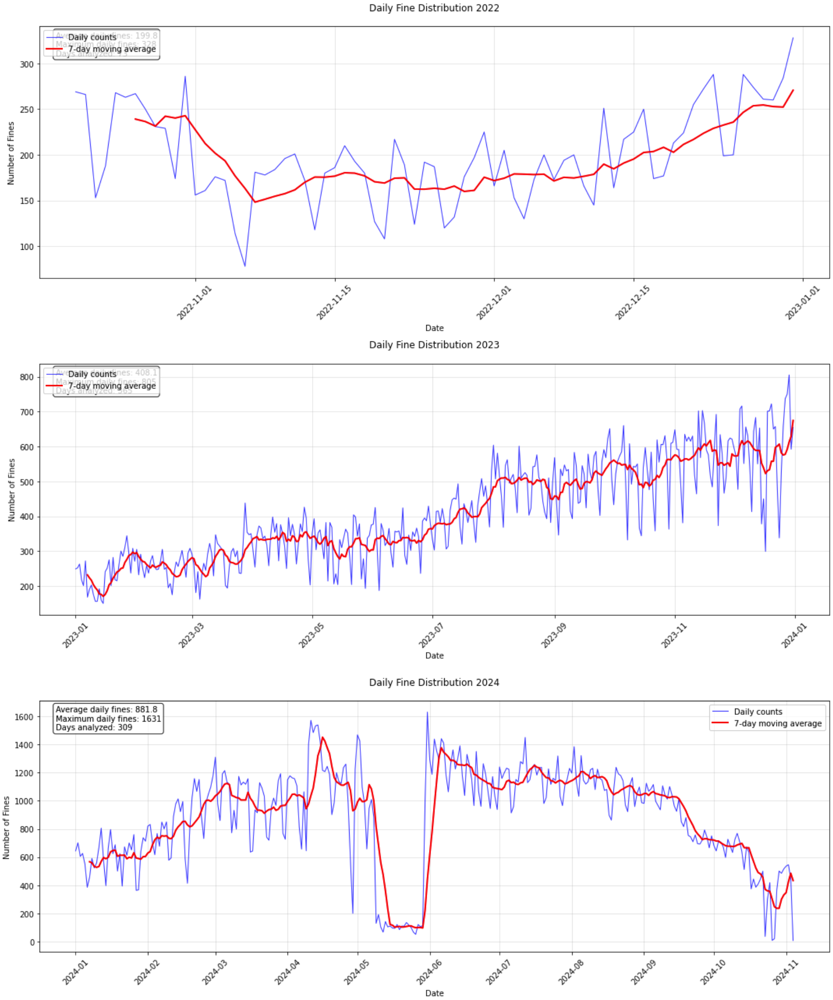
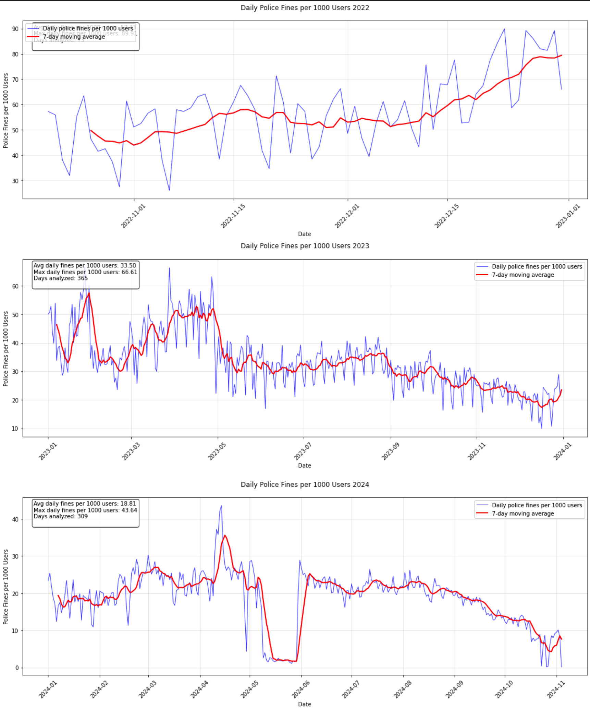
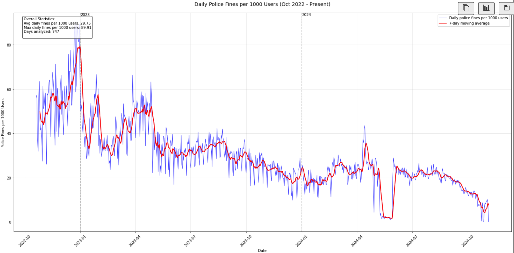
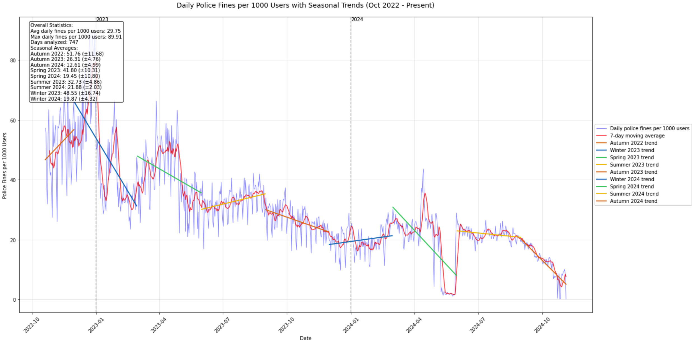
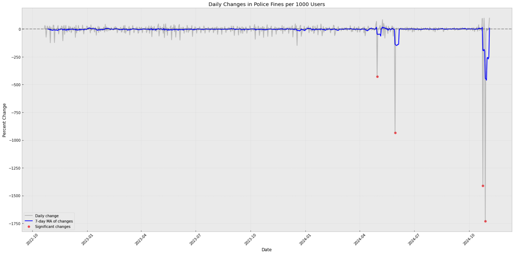
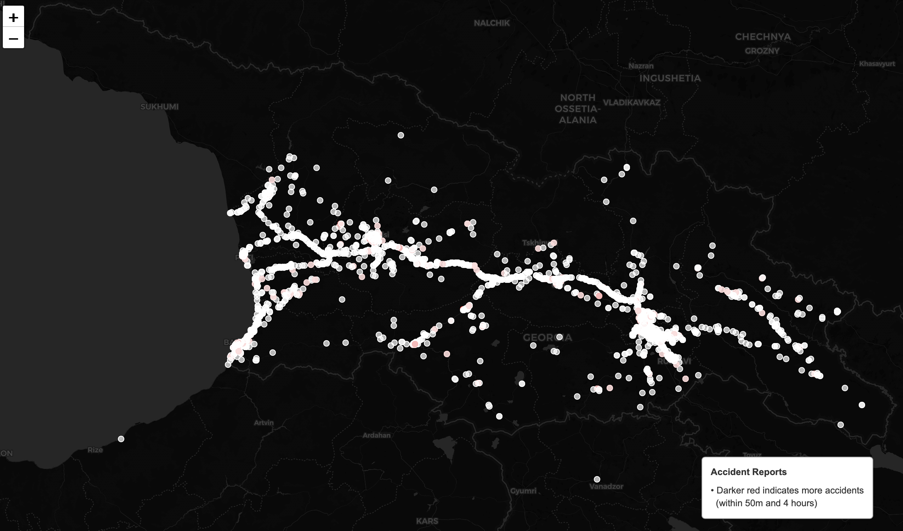

# Analysis of Fines and Camera Capabilities in Georgia

This project explores traffic fines, camera capabilities, license plate types (custom vs. standard), and the relationship between traffic conditions and external events in Georgia. It also includes the development of a navigation tool to help drivers avoid specific cameras.
### Author • Koba Jgenti
kjgenti@bu.edu // koba@borbalo.ge

## Table of Contents
## Table of Contents
- [Introduction](#introduction)
 - [Geographical and Monetary Context](#geographical-and-monetary-context)
 - [From Research to Practical Application](#from-research-to-practical-application)
   - [Context](#context)
   - [Technical Implementation](#technical-implementation) 
   - [Implementation Features](#implementation-features)
   - [Development Status](#development-status)
- [Data Collection and Processing](#data-collection-and-processing)
  - [Data Sources](#data-sources)
  - [Anonymization and Privacy](#anonymization-and-privacy)
- [Fine Dictionary Creation](#fine-dictionary-creation)
  - [Extracting Unique Articles and Reasons](#extracting-unique-articles-and-reasons)
- [Camera Visualizations](#camera-visualizations)
  - [Average Fine Amount by Camera](#average-fine-amount-by-camera)
  - [Weighted Camera Score Map](#weighted-camera-score-map)
  - [Camera Capabilities Map](#camera-capabilities-map)
- [Time-Based Analysis From Raw Counts to Meaningful Trends](#time-based-analysis-from-raw-counts-to-meaningful-trends)
  - [Iterative Approach Without Direct User Records](#iterative-approach-without-direct-user-records)
  - [Fines and Time Conclusion](#fines-and-time-conclusion)
- [Debunking the Myth Custom License Plates and Fines](#debunking-the-myth-custom-license-plates-and-fines)
  - [Data and Assumptions](#data-and-assumptions)
  - [Hypothesis Test Setup](#hypothesis-test-setup)
  - [Interpreting Statistical Significance](#interpreting-statistical-significance)
  - [Per-Camera Hypothesis Test](#per-camera-hypothesis-test)
- [Radar Report Clustering Accident Hotspots](#radar-report-clustering-accident-hotspots)
- [Technical Notes](#technical-notes)
  - [Code and Assets](#code-and-assets)
  - [Data Privacy and Sensitivity](#data-privacy-and-sensitivity)
  - [Disclaimer](#disclaimer)
  - [Authorship and Tools](#authorship-and-tools)
  - [Usage Restrictions](#usage-restrictions)
  - [Final Note](#final-note)
  
  ---

## Introduction
I started this project with the goal of uncovering interesting insights about traffic fines and camera systems in Georgia. A key focus was testing the urban myth that expensive custom license plates (costing around 10,000 Lari) lead to fewer fines.

Beyond debunking this myth, I wanted to explore patterns in fines over time, understand differences among cameras, and find practical uses for the data. The hope was to turn raw, anonymized information into valuable tools—such as a navigation feature to help drivers avoid cameras that fine for overdue tech inspections.

This exploration allowed me to combine data analysis with meaningful, real-world applications.

### Geographical and Monetary Context
- Georgia is a country located at the intersection of Eastern Europe and Western Asia.  
- The Georgian Lari (GEL) is the national currency. Historically, 1 USD ≈ 2.5 GEL (approximate and subject to fluctuation).  
- All monetary values mentioned in the analysis are in GEL unless otherwise stated.

## From Research to Practical Application
*(Note: I am placing this section near the start to motivate readers by showing a practical outcome of the research before diving into the full analysis.)*

### Context
In Georgia, certain "smart" traffic cameras detect vehicles with overdue technical inspections and issue automatic fines. For drivers who have missed their inspection date or require additional time to complete their inspection, these fines can accumulate rapidly, creating unnecessary financial burden.

Our solution addresses this challenge through Mapbox's Directions API and its powerful exclude parameter. We have developed a prototype navigation feature that enables drivers to temporarily avoid these inspection-checking cameras until they can schedule their inspection, providing a short-term solution that balances compliance requirements with practical considerations.

[](https://youtube.com/shorts/fU6iGGG938Y)

### Technical Implementation

Unlike conventional navigation systems such as Google Maps, which lack functionality for bypassing specific points of interest, Mapbox's Directions API provides an `exclude` parameter. This parameter enables the exclusion of specific road types or custom-defined coordinates from route calculations. The implementation requires the following core dependencies:

```kotlin
implementation(libs.mapbox.navigationcore.navigation)
implementation(libs.mapbox.navigationcore.uimaps)
implementation(libs.mapbox.navigationcore.uicomponents)
```
The routing logic is implemented through the following code structure:

```kotlin
val exclude = Exclude.builder()
    .points (listOf(Point.fromLngLat(19.95453549810296, 50.06561906131147)))
    .build()

val route = RouteOptions.builder()
    .applyDefaultNavigationOptions()
    .applyLanguageAndVoiceUnitOptions(requireContext())
    .coordinatesList( 
        listof(
        )
    )
    .excludeObject(exclude)
    .build()
```

### Implementation Features
The prototype incorporates three key components:

1. **Manual Camera Configuration**: Although I implemented code to retrieve camera locations in the `datacleaner.ipynb` script, camera data is not included in this demo for privacy purposes. Instead, there is one preset camera location that can be toggled on or off to demonstrate the route adjustment functionality, as shown in the demo. The implementation of additional camera locations is straightforward, requiring minimal code modifications to the existing framework.

2. **Routing Logic**: The Android application, developed using Kotlin and integrated with the Mapbox Directions API, processes routing requests by excluding camera coordinates from path calculations.
3. **Practical Application**: The implementation provides users with additional time to complete overdue inspections without incurring multiple fines, demonstrating practical utility when integrated with parsed data from datacleaner.ipynb.

### Development Status
The current implementation serves as a proof of concept, demonstrating the potential for customized navigation experiences using Mapbox Directions API and Kotlin. 

Repository contents include the Android demonstration application and supporting Python scripts, with provisions for future integration of production data sources.

## Data Collection and Processing

### Data Sources
The data originates from Borbalo’s live production database, with a cutoff date in November 2024. An initial SQL query was used to extract approximately 500,000 fines—representing about one-sixth of the annual nationwide total. The financial volume of these fines is around 30 million Lari (≈12 million USD).

A sample SQL query used to generate the dataset:

```sql
SET TIME ZONE 'Europe/Tbilisi';
COPY (
    SELECT 
        REGEXP_REPLACE(REGEXP_REPLACE(external_id, '[A-Za-z]', 'X', 'g'), '[0-9]', '0', 'g') AS "FineType",
        agency AS "Agency",
        violation_date AS "ViolationDate",
        REGEXP_REPLACE(REGEXP_REPLACE(license_plate, '[A-Za-z]', 'X', 'g'), '[0-9]', '0', 'g') AS "LicensePlateTemplate",
        (clean_license_plate !~ '^[A-Z]{2}[0-9]{3}[A-Z]{2}$' AND clean_license_plate !~ '^[A-Z]{2}[0-9]{4}$') AS "IsCustom",
        ff.created_at AS "ReceivedAt",
        final_discount_date AS "FinalDiscountDate",
        final_payment_date AS "FinalPaymentDate",
        original_value AS "OriginalAmount",
        final_amount AS "FinalAmount",
        article AS "Article",
        REPLACE(REPLACE(fine_reason, E'\n', ''), E'\r', '') AS "FineReasonText",
        region_name AS "Region",
        raion_name AS "Municipality",
        has_media AS "HasMedia",
        city_coordinates AS "CityCoords",
        evacuated AS "WasTowed",
        evacuation_coordinates AS "TowedFromCoords",
        evacuation_end_date AS "TowingEndDate",
        evacuation_fee AS "TowingFee",
        evacuation_start_date AS "TowingStartDate"
    FROM public.fines ff
    LEFT JOIN fine_cameras fc ON fc.id = ff.camera_id
    ORDER BY ff.created_at
) TO 'd:/borbalo_fines.csv' WITH (FORMAT CSV, HEADER);
```

### Anonymization and Privacy
All personally identifiable information (PII) and sensitive details (e.g., exact license plates, camera coordinates) were replaced or masked. For example:
	•	Letters and digits in identifiers were substituted with ‘X’ and ‘0’.
	•	Camera locations and other sensitive fields were altered or omitted to preserve privacy and maintain company confidentiality.

Due to these privacy considerations, the original data and specific camera or fine details will not be shared in this repository. This approach ensures compliance with privacy and ethical standards while still allowing for meaningful analysis.

## Fine Dictionary Creation

After extracting the fines data, the next step was to understand the types of violations and their associated reasons. To achieve this, I first isolated the `Article` and `FineReasonText` columns from the main dataset and created a structured dictionary of fines.

### Extracting Unique Articles And Reasons
Using Python and pandas, I extracted unique articles and fine reasons into a separate CSV file, `unique_articles.csv`:

```python
import pandas as pd

# Read the main fines dataset
df = pd.read_csv("borbalo_fines.csv")

# Extract unique articles and their corresponding fine reasons
unique_articles = df[['Article', 'FineReasonText']].drop_duplicates()

# Export to a new CSV file for further processing
unique_articles.to_csv("unique_articles.csv", index=False)
```

This `unique_articles.csv` file was then processed using an LLM to create a structured dictionary, which is saved in `dictionary.py`.

I also created a script `compare_violations.py` to verify the completeness of the dictionary, ensuring no articles were missed.

## Camera Visualizations

After understanding the fines dataset and creating a dictionary of violations, the next step was to visualize camera locations and their associated metrics. The following maps were generated using Python and Folium. Each map shows a different perspective on camera performance and fine distributions.

Note: Due to GitHub’s limitations, the interactive maps cannot be displayed directly in the `README`. Instead, you’ll find:
- Collapsible code snippets showing how each map was generated.
- Screenshots or static images (if you decide to include them) as a quick preview.
- Links to the hosted HTML pages or the HTML files in this repository that you can open in a browser to interact with the maps.


### Average Fine Amount by Camera
This first map plots all cameras and scales their markers based on the average fine amount issued. The sizes of the dots represent increments of roughly 170 Lari. Larger dots indicate cameras with higher average fines.

<details>
<summary>Show Code Snippet</summary>

```python
import folium
import pandas as pd
import numpy as np
from collections import defaultdict

df = pd.read_csv('borbalo_fines_2_updated.csv', delimiter=';', nrows=500000)

df[['latitude', 'longitude']] = df['Column4'].str.split(',', expand=True).astype(float)

map = folium.Map(
    location=[41.7151, 44.8271],
    zoom_start=7,
    tiles='OpenStreetMap'
)

location_counts = defaultdict(lambda: {'count': 0, 'total_amount': 0, 'violations': []})

for idx, row in df.iterrows():
    if pd.isna(row['latitude']) or pd.isna(row['longitude']):
        continue
    
    loc = (row['latitude'], row['longitude'])
    location_counts[loc]['count'] += 1
    location_counts[loc]['total_amount'] += row['FinalAmount'] / 100  # Convert tetri to GEL
    location_counts[loc]['violations'].append(row['FineReasonText'])

# Calculate average fine for each location
for loc in location_counts:
    location_counts[loc]['avg_fine'] = location_counts[loc]['total_amount'] / location_counts[loc]['count']

# Get min and max average fines for scaling
all_avg_fines = [data['avg_fine'] for data in location_counts.values()]
min_avg_fine = min(all_avg_fines)
max_avg_fine = max(all_avg_fines)

def get_color(avg_amount):
    if max_avg_fine == min_avg_fine:
        normalized = 1
    else:
        normalized = (avg_amount - min_avg_fine) / (max_avg_fine - min_avg_fine)
    
    if normalized < 0.25:
        return '#FFA07A'  # Light salmon
    elif normalized < 0.5:
        return '#FF6B6B'  # Lighter red
    elif normalized < 0.75:
        return '#FF0000'  # Red
    else:
        return '#8B0000'  # Dark red

def get_radius(avg_amount):
    if max_avg_fine == min_avg_fine:
        return 5
    normalized = (avg_amount - min_avg_fine) / (max_avg_fine - min_avg_fine)
    return 3 + (normalized * 12)

for loc, data in location_counts.items():
    total_fines = data['total_amount']
    count = data['count']
    avg_fine = data['avg_fine']
    
    # Get top 3 most common violations with their percentages
    violation_counts = pd.Series(data['violations']).value_counts()
    top_violations = violation_counts.head(3)
    total_violations = violation_counts.sum()
    
    # Calculate percentages and format violations
    violation_percentages = [(violation, (count/total_violations)*100) for violation, count in top_violations.items()]
    
    popup_content = f"""
    <b>Camera Location</b><br>
    <b>Average Fine:</b> {avg_fine:,.2f} GEL<br>
    <b>Most Common Violations:</b><br>
    {'<br>'.join([f'- {violation} ({percentage:.1f}%)' for violation, percentage in violation_percentages])}
    """
    
    folium.CircleMarker(
        location=loc,
        radius=get_radius(avg_fine),
        popup=folium.Popup(popup_content, max_width=300),
        color=get_color(avg_fine),
        fill=True,
        fillColor=get_color(avg_fine),
        fillOpacity=0.7,
        weight=1,
        tooltip=f"Camera: {avg_fine:,.2f} GEL avg. fine"
    ).add_to(map)

unique_cameras = len(location_counts)
title_html = f'''
<div style="position: fixed; 
            top: 10px; right: 50px; 
            border:2px solid grey; z-index:9999; font-size:14px;
            background-color:white;
            padding: 10px;
            border-radius: 5px;">
    <p><strong>Traffic Violation Cameras in Georgia</strong></p>
    <p>Total unique cameras: {unique_cameras}</p>
</div>
'''
map.get_root().html.add_child(folium.Element(title_html))

legend_html = f'''
<div style="position: fixed; 
            bottom: 50px; right: 50px; 
            border:2px solid grey; z-index:9999; font-size:14px;
            background-color:white;
            padding: 10px;
            border-radius: 5px;">
    <p><strong>Average Fine per Camera</strong></p>
    <p>
        <i style="background: #FFA07A; border-radius: 50%; width: 10px; height: 10px; display: inline-block;"></i> {min_avg_fine:,.2f} - {(max_avg_fine * 0.25):,.2f} GEL<br>
        <i style="background: #FF6B6B; border-radius: 50%; width: 10px; height: 10px; display: inline-block;"></i> {(max_avg_fine * 0.25):,.2f} - {(max_avg_fine * 0.5):,.2f} GEL<br>
        <i style="background: #FF0000; border-radius: 50%; width: 10px; height: 10px; display: inline-block;"></i> {(max_avg_fine * 0.5):,.2f} - {(max_avg_fine * 0.75):,.2f} GEL<br>
        <i style="background: #8B0000; border-radius: 50%; width: 10px; height: 10px; display: inline-block;"></i> {(max_avg_fine * 0.75):,.2f} - {max_avg_fine:,.2f} GEL
    </p>
</div>
'''
map.get_root().html.add_child(folium.Element(legend_html))

map.save('average_fine_map.html')
```
</details>


#### Interactive Version:
[View average_fine_map.html](https://kobajgenti.github.io/kjgenti-final_project/htmls/average_fine_map.html) (Open this HTML file in a web browser to interact with the map.)

### Weighted Camera Score Map
After creating the first map, the next idea was to understand a **weighted camera score.** This score might consider factors like the number of violations, severity of fines, or other normalized metrics. The result offers a different perspective: some cameras that appeared “evil” (issuing disproportionately high fines) in the raw average view are significantly toned down when considering a weighted scoring mechanism.

#### General Weighted Average
$$\bar{x}_w = \frac{\sum_{i=1}^{n} w_i x_i}{\sum_{i=1}^{n} w_i}$$

#### Average Fine
$$\text{Avg Fine} = \frac{\text{Total Amount of Fines}}{\text{Count of Violations}}$$

#### Weight Calculation
$$\text{Weight} = \tanh\left(\frac{\text{Count}}{\overline{\text{Count}}}\right)$$

#### Weighted Score
$$\text{Weighted Score} = \text{Avg Fine} \times \text{Weight}$$

<details>
<summary>Show Code Snippet</summary>

```python
import folium
import pandas as pd
import numpy as np
from collections import defaultdict
from scipy import stats

# Read data
df = pd.read_csv('borbalo_fines_2_updated.csv', delimiter=';', nrows=500000)
df[['latitude', 'longitude']] = df['Column4'].str.split(',', expand=True).astype(float)

map = folium.Map(
    location=[41.7151, 44.8271],
    zoom_start=7,
    tiles='OpenStreetMap'
)

location_counts = defaultdict(lambda: {'count': 0, 'total_amount': 0, 'violations': []})

# First, collect all the data
for idx, row in df.iterrows():
    if pd.isna(row['latitude']) or pd.isna(row['longitude']):
        continue
    
    loc = (row['latitude'], row['longitude'])
    location_counts[loc]['count'] += 1
    location_counts[loc]['total_amount'] += row['FinalAmount'] / 100
    location_counts[loc]['violations'].append(row['FineReasonText'])

# Calculate weighted scores
total_violations = sum(data['count'] for data in location_counts.values())
mean_violations = total_violations / len(location_counts)

def calculate_weighted_score(data):
    avg_fine = data['total_amount'] / data['count']
    weight = np.tanh(data['count'] / mean_violations)
    weighted_score = avg_fine * weight
    return weighted_score, avg_fine, weight

# Calculate and store all scores first
all_scores = []
for loc in location_counts:
    weighted_score, avg_fine, weight = calculate_weighted_score(location_counts[loc])
    location_counts[loc]['weighted_score'] = weighted_score
    location_counts[loc]['avg_fine'] = avg_fine
    location_counts[loc]['weight'] = weight
    all_scores.append(weighted_score)

# Now calculate min and max scores
min_score = min(all_scores)
max_score = max(all_scores)

def get_color(weighted_score):
    if max_score == min_score:
        normalized = 1
    else:
        normalized = (weighted_score - min_score) / (max_score - min_score)
    
    if normalized < 0.25:
        return '#FFA07A'
    elif normalized < 0.5:
        return '#FF6B6B'
    elif normalized < 0.75:
        return '#FF0000'
    else:
        return '#8B0000'

def get_radius(count):
    return np.log2(count + 1) * 2

# Now we can safely create the markers
for loc, data in location_counts.items():
    weighted_score = data['weighted_score']
    avg_fine = data['avg_fine']
    weight = data['weight']
    
    # Calculate violation percentages
    violation_counts = pd.Series(data['violations']).value_counts()
    total_violations_at_location = violation_counts.sum()
    top_violations = violation_counts.head(3)
    violation_percentages = [(violation, (count/total_violations_at_location)*100) 
                           for violation, count in top_violations.items()]
    
    popup_content = f"""
    <b>Camera Analysis</b><br>
    <b>Average Fine:</b> {avg_fine:,.2f} GEL<br>
    <b>Statistical Weight:</b> {weight:.2f}<br>
    <b>Weighted Score:</b> {weighted_score:,.2f}<br>
    <b>Most Common Violations:</b><br>
    {'<br>'.join([f'- {violation} ({percentage:.1f}%)' for violation, percentage in violation_percentages])}
    """
    
    folium.CircleMarker(
        location=loc,
        radius=get_radius(data['count']),
        popup=folium.Popup(popup_content, max_width=300),
        color=get_color(weighted_score),
        fill=True,
        fillColor=get_color(weighted_score),
        fillOpacity=0.7,
        weight=1,
        tooltip=f"Camera: {weighted_score:,.2f} weighted score"
    ).add_to(map)


title_html = f'''
<div style="position: fixed; 
            top: 10px; right: 50px; 
            border:2px solid grey; z-index:9999; font-size:14px;
            background-color:white;
            padding: 10px;
            border-radius: 5px;">
    <p><strong>Traffic Violation Cameras in Georgia (Weighted Analysis)</strong></p>
    <p>Number of cameras: {unique_cameras}</p>
    <p>Average violations per camera: {mean_violations:.1f}</p>
</div>
'''

legend_html = f'''
<div style="position: fixed; 
            bottom: 50px; right: 50px; 
            border:2px solid grey; z-index:9999; font-size:14px;
            background-color:white;
            padding: 10px;
            border-radius: 5px;">
    <p><strong>Weighted Score Range</strong></p>
    <p>
        <i style="background: #FFA07A; border-radius: 50%; width: 10px; height: 10px; display: inline-block;"></i> {min_score:,.2f} - {(max_score * 0.25):,.2f}<br>
        <i style="background: #FF6B6B; border-radius: 50%; width: 10px; height: 10px; display: inline-block;"></i> {(max_score * 0.25):,.2f} - {(max_score * 0.5):,.2f}<br>
        <i style="background: #FF0000; border-radius: 50%; width: 10px; height: 10px; display: inline-block;"></i> {(max_score * 0.5):,.2f} - {(max_score * 0.75):,.2f}<br>
        <i style="background: #8B0000; border-radius: 50%; width: 10px; height: 10px; display: inline-block;"></i> {(max_score * 0.75):,.2f} - {max_score:,.2f}
    </p>
    <p><strong>Circle Size:</strong> Relative to violation frequency</p>
</div>
'''

# Add title HTML
map.get_root().html.add_child(folium.Element(title_html))

# Add legend HTML
map.get_root().html.add_child(folium.Element(legend_html))

# Save the map
map.save('weighted_average_fine_map.html')
```
</details>


#### Interactive Version:
[View weighted_average_fine_map.html](https://kobajgenti.github.io/kjgenti-final_project/htmls/weighted_average_fine_map.html) (Open this HTML file in a web browser to interact with the map.)


#### Top 5 Cameras by Weighted Score

- Total unique camera locations analyzed: **609**
- Weighted scores range: **0.13 to 296.22**

1. Camera at (41.7117771464845, 44.787388890519935)
    - Weighted Score: 296.22
    - Average Fine: 308.84 Lari

`~6x National Average`


It would be interesting to investigate why this camera issues so many fines. Maybe it’s located near a tricky intersection or a popular racing spot?

2. (41.8059625, 44.7716383) – 531 violations, weighted score: 185.15, avg fine: 195.97 GEL `~3x National Average`
3. (41.69571968090777, 45.09413505482258) – 459 violations, weighted score: 184.85, avg fine: 202.68 GEL `~3x National Average`
4. (41.74021370128867, 44.77027666495096) – 453 violations, weighted score: 178.63, avg fine: 196.60 GEL `~3x National Average`
5. (41.640659, 41.6141142) – 357 violations, weighted score: 178.56, avg fine: 214.40 GEL`~3x National Average`

### Camera Capabilities Map

After identifying the most "evil" cameras, the next step was to analyze the variety of violations each camera could detect. Using the dictionary of fines, I examined how many violation types each camera can handle, from basic speed-only detection up to “smart” cameras capable of identifying numerous different infractions.


<details>
<summary>Show Code Snippet</summary>

```python
import folium
import pandas as pd
import numpy as np
from collections import defaultdict

# Traffic violations dictionary
traffic_violations = {
    # DUI and Vehicle Transfer
    "115-1-1": "Transferring vehicle to intoxicated person",
    "115-1-3": "Repeated transfer of vehicle to intoxicated person",
    "116-1": "Driving under influence (<0.7‰)",
    "116-2": "Driving under influence (>0.7‰) or test refusal",
    "116-3": "Repeated drunk driving",
    "116-4": "Driving without license",
    "116-4-1": "Operating vehicle with suspended license",
    "116-4-2": "Operating vehicle without license or with suspended license for other violations",
    "116-4-3": "Repeated violation of operating without license within 1 year",
    "116-5": "Repeated drunk driving without license",
    "116-6": "Repeated drunk driving with suspended license",
    "116-7": "Causing damage while driving under influence",
    "116-8": "Operating vehicle without license",
    "116-8-1": "Operating vehicle with suspended license for other violations",
    "118-0-1": "Not wearing seatbelt (driver/front passenger)",
    "118-0-2": "Using mobile phone while driving",
    "118-0-3": "Not wearing helmet on motorcycle/moped",
    "118-1": "Operating technically uninspected vehicle",
    "118-2-1": "Transferring technically uninspected vehicle - Individual",
    "118-2-2": "Transferring technically uninspected vehicle - Legal entity",
    "118-3-1": "Repeated violation by individual of technical inspection requirements within 30 days",
    "118-3-2": "Repeated violation by legal entity of technical inspection requirements within 30 days",
    "118-4-1": "Operating motorcycle under alcohol influence",
    "118-4-2": "Operating motorcycle under narcotic influence",
    "118-5-1": "Repeated violation by individual after administrative penalty",
    "118-5-2": "Repeated violation by legal entity after administrative penalty",
    "119-1": "Driving without carrying license",
    "119-1-1": "Transporting construction materials or waste with faulty cargo equipment",
    "119-2": "Operating vehicle with malfunctioning equipment",
    "119-5": "Operating illegally modified vehicle",
    "119-6": "Operating vehicle without special category license",
    "119-7": "Operating vehicle with tinted windows",
    "119-7-1": "Window tint exceeding limits by 10%",
    "119-7-2": "Third violation of tinted windows regulation",
    "119-8": "Damage caused by violation of vehicle operation rules",
    "120": "Illegal installation/use of emergency lights/sirens",
    "120-1": "Illegal use of emergency vehicle indicators",
    "120-3-1": "Obstructing emergency vehicles",
    "121-0-1": "Using invalid/canceled license or providing false information",
    "121-1": "Driving without valid license",
    "121-1-1": "Using another person's license/providing false information",
    "121-2": "Transferring vehicle to unlicensed person",
    "121-3": "Causing damage while driving without license",
    "121-4": "Repeated damage while driving without license",
    "122-1": "Operating without license plates",
    "122-2": "Operating unregistered vehicle",
    "122-3": "Operating with concealed plates",
    "122-4": "Operating with fake/modified plates",
    "123-1": "Leaving accident scene",
    "123-2": "Not stopping for police",
    "123-2-1": "Leaving accident scene without license",
    "123-3": "Failing to comply with police stop signal",
    "123-4": "Creating hazardous situation",
    "123-4-1": "Creating hazardous situation without license",
    "123-5-1": "Causing minor damage/injury through violation",
    "125": "Minor damage to vehicle, cargo, road, or person through violations",
    "125-0-1": "Causing minor damage through pedestrian right violations",
    "125-0-2": "Unauthorized use of bus lane",
    "125-0-3": "Bicycle lane violations",
    "125-0-4": "Parking without visible registration plates",
    "125-0-5": "Taxi parking violations",
    "125-0-8": "Various parking violations",
    "125-1": "Speeding (15-40 km/h over limit)",
    "125-1-1": "Speeding (over 40 km/h)",
    "125-1-2": "Bus lane violations",
    "125-1-3": "Bicycle lane violations",
    "125-1-5": "Unauthorized taxi parking",
    "125-1-6": "Abandoning vehicle on road",
    "125-1-7": "Unauthorized drifting",
    "125-2": "Passenger carrier speeding",
    "125-2-1": "Parking without payment in Tbilisi municipality",
    "125-2-2": "Electric vehicle parking without charging connection",
    "125-2-3": "Using parked vehicle for commercial activities in Tbilisi",
    "125-2-5": "Unauthorized parking in disabled parking space or blocking access ramp",
    "125-2-6": "Violation of other parking rules in Tbilisi",
    "125-2-7": "Parking incorrect vehicle type in designated areas",
    "125-3-4": "Parking without payment",
    "125-3-5": "Other parking violations, parking on sidewalk",
    "125-5-1": "Pedestrian right of way violations",
    "125-5-2": "Repeated pedestrian right of way violations",
    "125-6": "General traffic safety violations",
    "125-6-1": "Organized blocking of road with vehicles",
    "125-6-2": "Violation of vehicle positioning or maneuvering rules",
    "125-6-3": "Improper mounting of identification signs",
    "125-7": "Traffic signal/sign violations",
    "125-7-1": "Crossing solid center line",
    "125-7-2": "Repeated crossing of solid center line",
    "125-7-3": "Driving in opposite direction",
    "125-8": "Parking and stopping violations",
    "125-8-1": "Unauthorized parking in disabled parking space or blocking access ramp",
    "125-8-2": "Violation of no-stopping or no-parking signs",
    "125-9": "Obstructing traffic with improper stopping",
    "125-9-1": "Creating hazardous situation through violations",
    "125-9-2": "Creating traffic jam through violations",
    "127-0-1": "Passenger/cargo transportation violations",
    "127-0-6": "Transportation violations causing damage",
    "127-1": "Non-driver traffic participant violations",
    "127-1-1": "Cargo transportation violations",
    "127-1-4": "Operating oversized vehicle without permit",
    "127-1-5": "Repeated oversized vehicle violations",
    "127-3": "Transportation violations causing damage",
    "131-1": "Littering up to 2kg",
    "131-2": "Littering from buildings",
    "131-3": "Littering from vehicles",
    "134-1": "Road infrastructure violations",
    "135-2-1": "Heavy vehicle movement restrictions in Tbilisi",
    "135-2-2": "Repeated heavy vehicle movement violations",
    "135-3-1": "Bus stop violations in Tbilisi",
    "135-3-2": "Other vehicles in bus stops",
    "135-4-1": "Taxi permit violations",
    "135-4-2": "Operating taxi without permit",
    "142-1-1": "Face mask violations",
    "142-1-3": "Mask violations in public transport",
    "142-1-4": "Mask violations in taxi",
    "142-1-5": "Repeated mask violations",
    "145-1-1": "Minor cannabis possession",
    "166-1": "Minor hooliganism",
    "167-1": "Illegal weapon discharge",
    "173-1": "Disobeying law enforcement",
    "181-1-1": "Carrying cold weapons in public"
}

# Read data
df = pd.read_csv('borbalo_fines_2_updated.csv', delimiter=';', nrows=500000)
df[['latitude', 'longitude']] = df['Column4'].str.split(',', expand=True).astype(float)

# Create a dictionary to store camera capabilities
camera_capabilities = defaultdict(lambda: {
    'violation_types': set(),
    'total_violations': 0,
    'violations_breakdown': defaultdict(int),
    'total_amount': 0
})

# Collect data about camera capabilities
for idx, row in df.iterrows():
    if pd.isna(row['latitude']) or pd.isna(row['longitude']):
        continue
    
    loc = (row['latitude'], row['longitude'])
    camera_capabilities[loc]['violation_types'].add(row['Article'])
    camera_capabilities[loc]['total_violations'] += 1
    camera_capabilities[loc]['violations_breakdown'][row['Article']] += 1
    camera_capabilities[loc]['total_amount'] += row['FinalAmount'] / 100

# Create the map
map = folium.Map(
    location=[41.7151, 44.8271],
    zoom_start=7,
    tiles='OpenStreetMap'
)

# Calculate statistics for color scaling
capabilities_counts = [len(data['violation_types']) for data in camera_capabilities.values()]
max_capabilities = max(capabilities_counts)
min_capabilities = min(capabilities_counts)

def get_color(num_capabilities):
    """Color scheme from yellow (few capabilities) to red (many capabilities)"""
    if max_capabilities == min_capabilities:
        normalized = 1
    else:
        normalized = (num_capabilities - min_capabilities) / (max_capabilities - min_capabilities)
    
    if normalized < 0.25:
        return '#FFD700'  # Gold
    elif normalized < 0.5:
        return '#FFA500'  # Orange
    elif normalized < 0.75:
        return '#FF4500'  # OrangeRed
    else:
        return '#8B0000'  # DarkRed

def get_radius(count):
    """Radius based on number of violations"""
    return np.log2(count + 1) * 2

# Add markers to map
# Modify the popup content section
for loc, data in camera_capabilities.items():
    num_capabilities = len(data['violation_types'])
    total_violations = data['total_violations']
    
    # Sort violations by frequency
    sorted_violations = sorted(
        data['violations_breakdown'].items(), 
        key=lambda x: x[1], 
        reverse=True
    )
    
    # Create violation breakdown text with only percentages
    violation_text = "<br>".join([
        f"- {traffic_violations[code]} ({(count/total_violations*100):.1f}%)"
        for code, count in sorted_violations
    ])
    
    popup_content = f"""
    <b>Camera Capabilities Analysis</b><br>
    <b>Number of Different Violation Types:</b> {num_capabilities}<br>
    <b>Average Fine:</b> {data['total_amount']/total_violations:,.2f} GEL<br>
    <br>
    <b>Violation Types Breakdown:</b><br>
    {violation_text}
    """
    
    folium.CircleMarker(
        location=loc,
        radius=get_radius(total_violations),
        popup=folium.Popup(popup_content, max_width=400),
        color=get_color(num_capabilities),
        fill=True,
        fillColor=get_color(num_capabilities),
        fillOpacity=0.7,
        weight=1,
        tooltip=f"Camera detects {num_capabilities} violation types"
    ).add_to(map)

# Add title with statistics
title_html = f'''
<div style="position: fixed; 
            top: 10px; right: 50px; 
            border:2px solid grey; z-index:9999; font-size:14px;
            background-color:white;
            padding: 10px;
            border-radius: 5px;">
    <p><strong>Traffic Camera Capabilities in Georgia</strong></p>
    <p>Total unique cameras: {len(camera_capabilities)}</p>
    <p>Camera capabilities range: {min_capabilities} to {max_capabilities} violation types</p>
    <p>Average capabilities: {np.mean(capabilities_counts):.1f} violation types</p>
</div>
'''
map.get_root().html.add_child(folium.Element(title_html))

# Add legend
legend_html = f'''
<div style="position: fixed; 
            bottom: 50px; right: 50px; 
            border:2px solid grey; z-index:9999; font-size:14px;
            background-color:white;
            padding: 10px;
            border-radius: 5px;">
    <p><strong>Number of Detectable Violation Types</strong></p>
    <p>
        <i style="background: #FFD700; border-radius: 50%; width: 10px; height: 10px; display: inline-block;"></i> {min_capabilities} - {int(max_capabilities * 0.25)} types<br>
        <i style="background: #FFA500; border-radius: 50%; width: 10px; height: 10px; display: inline-block;"></i> {int(max_capabilities * 0.25)} - {int(max_capabilities * 0.5)} types<br>
        <i style="background: #FF4500; border-radius: 50%; width: 10px; height: 10px; display: inline-block;"></i> {int(max_capabilities * 0.5)} - {int(max_capabilities * 0.75)} types<br>
        <i style="background: #8B0000; border-radius: 50%; width: 10px; height: 10px; display: inline-block;"></i> {int(max_capabilities * 0.75)} - {max_capabilities} types
    </p>
    <p><strong>Circle Size:</strong> Logarithmic scale of total violations</p>
</div>
'''
map.get_root().html.add_child(folium.Element(legend_html))

map.save('camera_capabilities_map.html')

# Print detailed statistics
print("\nCamera Capabilities Analysis:")
print(f"Total unique camera locations: {len(camera_capabilities)}")
print(f"Range of capabilities: {min_capabilities} to {max_capabilities} violation types")
print(f"Average number of detectable violations: {np.mean(capabilities_counts):.1f}")

print("\nTop 5 most versatile cameras:")
top_cameras = sorted(
    camera_capabilities.items(), 
    key=lambda x: len(x[1]['violation_types']), 
    reverse=True
)[:5]

for loc, data in top_cameras:
    print(f"\nCamera at {loc}:")
    print(f"- Can detect {len(data['violation_types'])} different violation types")
    print(f"- Total violations: {data['total_violations']:,}")
    print(f"- Total fines: {data['total_amount']:,.2f} GEL")
    print("Top 3 most frequent violations:")
    sorted_violations = sorted(
        data['violations_breakdown'].items(), 
        key=lambda x: x[1], 
        reverse=True
    )[:3]
    for code, count in sorted_violations:
        print(f"  * {traffic_violations[code]}: {count} times ({count/data['total_violations']*100:.1f}%)")

# Calculate overall statistics about violation types
print("\nViolation Type Distribution Analysis:")
violation_type_counts = defaultdict(int)
for camera_data in camera_capabilities.values():
    for violation_type in camera_data['violation_types']:
        violation_type_counts[violation_type] += 1

print("\nMost common camera capabilities (% of cameras that can detect each violation):")
total_cameras = len(camera_capabilities)
sorted_capabilities = sorted(
    violation_type_counts.items(), 
    key=lambda x: x[1], 
    reverse=True
)[:10]

for violation_code, count in sorted_capabilities:
    percentage = (count / total_cameras) * 100
    print(f"- {traffic_violations[violation_code]}: {count} cameras ({percentage:.1f}%)")
```
</details>


#### Interactive Version:
[View camera_capabiities_map.html](https://kobajgenti.github.io/kjgenti-final_project/htmls/camera_capabilities_map.html) (Open this HTML file in a web browser to interact with the map.)

#### Key Findings:
- Total unique camera locations analyzed: **609**
- Violation articles detectable by a single camera range from **1 to 12.**
- On average, cameras can detect 3.3 types of violations.
- “Smart” cameras (capable of detecting more violation types) proved more profitable overall, issuing more fines and covering a broader range of infractions.
- A business insight: investing in more capable, “smart” cameras appears to pay off, as they generate higher returns by covering multiple violation categories.

#### Camera Specialization Analysis:
- Speed-only cameras: 217 (35.6%)
- Lane violation cameras: 31 (5.1%)
- Smart cameras (multiple violation types): 361 (59.3%)

#### Smartest Cameras and Their Detected Violations

The most advanced cameras can detect up to **12 different types of violations**, covering a broad range of unsafe behaviors:

- **Speeding & Safety Gear:**
  - Speeding (15-40 km/h over limit)
  - Not wearing seatbelt (driver/front passenger)

- **Driver Behavior & Distractions:**
  - Using mobile phone while driving

- **Substance-Influenced Operation:**
  - Operating motorcycle under alcohol influence
  - Operating motorcycle under narcotic influence

- **Technical Inspection & Maintenance Compliance:**
  - Repeated violation by individual of technical inspection requirements within 30 days
  - Repeated violation by legal entity of technical inspection requirements within 30 days
  - Transferring technically uninspected vehicle (Individual)
  - Transferring technically uninspected vehicle (Legal entity)

- **Repeated Administrative Penalties:**
  - Repeated violation by individual after administrative penalty
  - Repeated violation by legal entity after administrative penalty

- **General Traffic Safety:**
  - General traffic safety violations (e.g., failing to yield, improper turns, etc.)


## Debunking the Myth: Custom License Plates and Fines

A popular urban legend in Georgia suggests that purchasing a custom license plate (costing around 10,000 Lari, or approximately 4,000 USD) allows the owner to receive fewer or no fines, effectively placing them "above the law." Basic license plates, by contrast, are essentially free. The claim is that by owning a custom plate, you might face less enforcement or be overlooked by traffic cameras.

To test this empirically, we conducted a hypothesis test comparing the fine frequencies between vehicles with custom license plates and those with standard plates.

### Data and Assumptions

- **Custom Plates:** We identified custom plates using a boolean flag `IsCustomPlate` in the extracted dataset. Custom plates are distinguished from standard plates by their format and the known cost structure.
- **Standard Plates:** The standard Georgian plate format is two letters, three digits, then two letters (e.g., AB-123-CD).
- **Sample Size:** We analyzed about 700-800 fines associated with custom plates. While not a large sample, it still provides some data points to work with.

*(Note: Since there is a possibility, though extremely unlikely, that a custom plate might follow the same pattern purely by coincidence, we note this as a theoretical concern. However, the probability of paying 10,000 Lari for a plate identical to a standard format is negligible. Thus, we assume our filtering correctly classifies custom versus standard plates.)*

### Hypothesis Test Setup

- **Null Hypothesis (H0):** Custom license plates do not receive fewer fines on average than standard plates.
- **Alternative Hypothesis (H1):** Custom license plates receive significantly fewer (or more) fines than standard plates.

After performing the hypothesis test, the results indicated a statistically significant difference in fines. However, statistical significance alone does not necessarily imply practical significance.

### Interpreting Statistical Significance

- **Small Custom Plate Sample:**  
  Few custom plate fines mean a few outliers can create the illusion of significance.

- **Minimal Median Differences:**  
  Median fines are often almost identical, showing no real advantage for custom plates. In 2024 for both plates is was 40 Lari.

- **High Variability:**  
  Large standard deviations in both groups mean overlapping fine ranges and no clear enforcement gap.

- **Uncontrolled Factors:**  
  Driving habits, vehicle types, and other unknowns could explain differences, not just plate type.

- **Practical vs. Statistical:**  
  A statistically significant p-value doesn’t guarantee that any real-world benefits exist for custom plate owners.


In summary, while the test flags certain differences as statistically significant, the small sample size, overlapping distributions, and external confounding factors mean these differences are unlikely to hold practical relevance. The myth that custom plates inherently protect drivers from fines does not stand up to these findings.

### Per-Camera Hypothesis Test

Beyond yearly comparisons, we also examined individual cameras where we had at least 5 custom plate fines recorded. Out of 9 such cameras:

- 6 cameras showed no significant difference.
- 2 cameras favored custom plates.
- 1 camera favored regular plates.

These mixed results reinforce that custom plates do not uniformly receive fewer fines. 

<details>
<summary>Show Code Snippet</summary>

```python
import pandas as pd
import numpy as np
from scipy import stats
import folium

# Read the CSV file with low_memory=False to handle mixed types
df = pd.read_csv('borbalo_fines_2_updated.csv', delimiter=';', low_memory=False)

# Convert FinalAmount from tetri to GEL
df['FinalAmount_GEL'] = df['FinalAmount'] / 100

# Split coordinates into latitude and longitude
df[['latitude', 'longitude']] = df['Column4'].str.split(',', expand=True).astype(float)

# Function to analyze differences at each camera location
def analyze_camera_location(camera_data, location):
    custom_fines = camera_data[camera_data['IsCustom'] == 't']['FinalAmount_GEL']
    regular_fines = camera_data[camera_data['IsCustom'] == 'f']['FinalAmount_GEL']
    
    # Lower minimum samples requirement
    min_custom = 5  # Minimum samples for custom plates
    min_regular = 20  # Minimum samples for regular plates
    
    if len(custom_fines) < min_custom or len(regular_fines) < min_regular:
        return None
    
    try:
        # Statistical test
        statistic, p_value = stats.mannwhitneyu(custom_fines, regular_fines, alternative='two-sided')
        
        result = {
            'location': location,
            'custom_count': len(custom_fines),
            'regular_count': len(regular_fines),
            'custom_mean': custom_fines.mean(),
            'regular_mean': regular_fines.mean(),
            'p_value': p_value,
            'significant': p_value < 0.05,
            'difference': custom_fines.mean() - regular_fines.mean()
        }
        return result
    except:
        return None

# Group by camera location and analyze
camera_results = []
for location, group in df.groupby(['latitude', 'longitude']):
    if pd.isna(location[0]) or pd.isna(location[1]):  # Skip if coordinates are NaN
        continue
    result = analyze_camera_location(group, location)
    if result:
        camera_results.append(result)

# Convert results to DataFrame
if not camera_results:
    print("No camera locations with sufficient data found.")
    exit()

results_df = pd.DataFrame(camera_results)

# Print summary
print("Camera Analysis Summary:")
print(f"Total cameras analyzed: {len(results_df)}")
if 'significant' in results_df.columns:
    sig_count = results_df['significant'].sum()
    print(f"Cameras with significant differences: {sig_count}")
    
    # Print top differences
    print("\nTop locations with largest differences (where significant):")
    sig_results = results_df[results_df['significant']]
    sig_results = sig_results.sort_values('difference', ascending=False)
    
    print("\nLocations where custom plates pay MORE:")
    more = sig_results[sig_results['difference'] > 0].head()
    for _, row in more.iterrows():
        print(f"Location ({row['location'][0]:.6f}, {row['location'][1]:.6f}):")
        print(f"  Custom mean: {row['custom_mean']:.2f} GEL (n={row['custom_count']})")
        print(f"  Regular mean: {row['regular_mean']:.2f} GEL (n={row['regular_count']})")
        print(f"  Difference: {row['difference']:.2f} GEL (p={row['p_value']:.4f})")
        
    print("\nLocations where custom plates pay LESS:")
    less = sig_results[sig_results['difference'] < 0].head()
    for _, row in less.iterrows():
        print(f"Location ({row['location'][0]:.6f}, {row['location'][1]:.6f}):")
        print(f"  Custom mean: {row['custom_mean']:.2f} GEL (n={row['custom_count']})")
        print(f"  Regular mean: {row['regular_mean']:.2f} GEL (n={row['regular_count']})")
        print(f"  Difference: {row['difference']:.2f} GEL (p={row['p_value']:.4f})")

# Create map visualization
map = folium.Map(
    location=[41.7151, 44.8271],  # Centered on Georgia
    zoom_start=7,
    tiles='OpenStreetMap'
)

def get_color(difference, p_value):
    if p_value >= 0.05:
        return 'gray'  # Not significant
    elif difference > 0:
        return 'red'   # Custom plates pay more
    else:
        return 'blue'  # Custom plates pay less

# Add markers for each camera
for _, row in results_df.iterrows():
    color = get_color(row['difference'], row['p_value'])
    
    popup_content = f"""
    <b>Camera Analysis</b><br>
    <b>Custom Plates:</b><br>
    - Average: {row['custom_mean']:.2f} GEL<br>
    - Sample size: {row['custom_count']}<br>
    <b>Regular Plates:</b><br>
    - Average: {row['regular_mean']:.2f} GEL<br>
    - Sample size: {row['regular_count']}<br>
    <b>Difference:</b> {row['difference']:.2f} GEL<br>
    <b>P-value:</b> {row['p_value']:.4f}
    """
    
    folium.CircleMarker(
        location=row['location'],
        radius=8,
        popup=folium.Popup(popup_content, max_width=300),
        color=color,
        fill=True,
        fillColor=color,
        fillOpacity=0.7,
        weight=1
    ).add_to(map)

# Add legend
legend_html = """
<div style="position: fixed; 
            bottom: 50px; right: 50px; 
            border:2px solid grey; z-index:9999; font-size:14px;
            background-color:white;
            padding: 10px;
            border-radius: 5px;">
    <p><strong>Per Camera Hypotesis Test</strong></p>
    <p>
        <i style="background: red; border-radius: 50%; width: 10px; height: 10px; display: inline-block;"></i> Custom plates pay more (p < 0.05)<br>
        <i style="background: blue; border-radius: 50%; width: 10px; height: 10px; display: inline-block;"></i> Custom plates pay less (p < 0.05)<br>
        <i style="background: gray; border-radius: 50%; width: 10px; height: 10px; display: inline-block;"></i> No significant difference
    </p>
</div>
"""
map.get_root().html.add_child(folium.Element(legend_html))

# Save the map
map.save('per_camera_h_test_map.html')
```
</details>



#### Interactive Version:
[View per_camera_h_test_map.html](https://kobajgenti.github.io/kjgenti-final_project/htmls/per_camera_h_test_map.html) (Open this HTML file in a web browser to interact with the map.)

*In light of these comprehensive analyses and rigorous statistical evaluations, the data conclusively demonstrate that custom license plates do not confer any consistent enforcement advantage or preferential treatment*

## Time-Based Analysis: From Raw Counts to Meaningful Trends

After exploring differences by camera and plate type, I shifted focus to understanding how fines evolve over time. 

**Daily and Seasonal Trends:**  
Examining raw daily counts over multiple years was misleading because the Borbalo user base grew significantly. We currently do not have a system that keeps historical monthly active user records. To address this, I resorted to unconventional methods. For example, I parsed daily statistics from our Telegram chatbot logs to approximate monthly user counts. Using these proxy values, I scaled the fines data to a "per thousand users" metric. This normalization helped separate genuine behavioral or enforcement shifts from mere changes in population.

### Iterative Approach Without Direct User Records

To uncover meaningful patterns, I employed several visualization and analysis steps. Each step includes a snippet of code (hidden by default) and an image placeholder representing the resulting graph or chart.

#### Step 1: Raw Counts per Day  
At first, I plotted the raw number of fines per day for multiple years. This naive approach often suggested trends that disappeared once normalized.

<details>
<summary>Show Code Snippet</summary>

```python
import pandas as pd
import matplotlib.pyplot as plt
from datetime import datetime

# Convert ViolationDate to datetime
df['ViolationDate'] = pd.to_datetime(df['ViolationDate'], format='%d.%m.%y %H:%M')

# Create figure with three subplots
fig, (ax1, ax2, ax3) = plt.subplots(3, 1, figsize=(15, 18))

def plot_year_data(df_year, ax, year, start_date=None, end_date=None):
    # Filter data for the year and date range if specified
    mask = (df_year['ViolationDate'].dt.year == year)
    if start_date:
        mask &= (df_year['ViolationDate'] >= start_date)
    if end_date:
        mask &= (df_year['ViolationDate'] <= end_date)
    
    df_filtered = df_year[mask].copy()
    
    # Create daily counts
    daily_counts = df_filtered.groupby(df_filtered['ViolationDate'].dt.date).size().reset_index()
    daily_counts.columns = ['ViolationDate', 'Count']
    
    # Plot daily counts
    ax.plot(daily_counts['ViolationDate'], daily_counts['Count'], 
            color='blue', alpha=0.7, linewidth=1, label='Daily counts')
    
    # Add 7-day moving average
    daily_counts['MovingAvg'] = daily_counts['Count'].rolling(window=7).mean()
    ax.plot(daily_counts['ViolationDate'], daily_counts['MovingAvg'], 
            color='red', linewidth=2, label='7-day moving average')
    
    # Customize the plot
    ax.set_title(f'Daily Fine Distribution {year}', pad=20)
    ax.set_xlabel('Date')
    ax.set_ylabel('Number of Fines')
    ax.grid(True, alpha=0.3)
    ax.legend()
    
    # Rotate x-axis labels
    plt.setp(ax.get_xticklabels(), rotation=45)
    
    # Add statistics box
    stats_text = (
        f"Total fines: {daily_counts['Count'].sum():,}\n"
        f"Average daily fines: {daily_counts['Count'].mean():.1f}\n"
        f"Maximum daily fines: {daily_counts['Count'].max()}\n"
        f"Days analyzed: {len(daily_counts)}"
    )
    ax.text(0.02, 0.98, stats_text, 
            transform=ax.transAxes,
            verticalalignment='top',
            bbox=dict(boxstyle='round', facecolor='white', alpha=0.8))
    
    # Print detailed statistics
    print(f"\nDetailed Statistics for {year}:")
    print(f"Total number of fines: {daily_counts['Count'].sum():,}")
    print(f"Average fines per day: {daily_counts['Count'].mean():.2f}")
    print(f"Maximum fines in one day: {daily_counts['Count'].max():,}")
    max_date = daily_counts.loc[daily_counts['Count'].idxmax(), 'ViolationDate']
    print(f"Day with most fines: {max_date}")
    
    # Monthly statistics for the year
    monthly_stats = df_filtered.groupby(df_filtered['ViolationDate'].dt.to_period('M')).size()
    print(f"\nMonthly totals for {year}:")
    for month, count in monthly_stats.items():
        print(f"{month}: {count:,} fines")
    
    # Day of week analysis
    day_of_week_stats = df_filtered.groupby(df_filtered['ViolationDate'].dt.day_name()).size().sort_values(ascending=False)
    print(f"\nAverage fines by day of week for {year}:")
    for day, count in day_of_week_stats.items():
        avg = count / len(daily_counts) * 7  # Multiply by 7 to get weekly average
        print(f"{day}: {avg:.1f}")
    print("\n" + "="*50)

# Plot 2022 (from October 20)
plot_year_data(df, ax1, 2022, start_date=pd.to_datetime('2022-10-20'))

# Plot 2023 (full year)
plot_year_data(df, ax2, 2023)

# Plot 2024 (up to current date)
plot_year_data(df, ax3, 2024)

# Adjust layout
plt.tight_layout()
plt.show()
```

</details>




#### Step 2: Normalizing per Thousand Users

Next, I introduced normalization. By dividing daily fines by the number of users (per thousand), some perceived trends inverted or vanished, confirming the importance of scaling.

<details>
<summary>Show Code Snippet</summary>

```python
import pandas as pd
import matplotlib.pyplot as plt
from datetime import datetime
import numpy as np

# Create date range for user stats (monthly) - exactly 26 months to match user_stats
date_range = pd.date_range(start='2022-10-01', end='2024-11-30', freq='M')[:26]
user_stats = [-]

# Verify lengths match
assert len(date_range) == len(user_stats), "Length mismatch between dates and user stats"

# Create user DataFrame
users_df = pd.DataFrame({
    'Date': date_range,
    'Users': user_stats
})

# Function to get user count for a specific date
def get_user_count(date):
    # Find the closest date in our user stats that's not in the future
    valid_dates = users_df[users_df['Date'] <= date]
    if len(valid_dates) == 0:
        return user_stats[0]  # Use first available count for earlier dates
    return valid_dates.iloc[-1]['Users']

# Create figure with three subplots
fig, (ax1, ax2, ax3) = plt.subplots(3, 1, figsize=(15, 18))

def plot_normalized_police_fines(df_year, ax, year, start_date=None, end_date=None):
    # Filter police fines
    police_df = df_year[df_year['Agency'] == 'Police'].copy()
    
    # Filter data for the year and date range
    mask = (police_df['ViolationDate'].dt.year == year)  # Changed from Date to ViolationDate
    if start_date:
        mask &= (police_df['ViolationDate'] >= start_date)  # Changed from Date to ViolationDate
    if end_date:
        mask &= (police_df['ViolationDate'] <= end_date)  # Changed from Date to ViolationDate
    
    df_filtered = police_df[mask]
    
    # Create daily counts
    daily_counts = df_filtered.groupby(df_filtered['ViolationDate'].dt.date).size().reset_index()  # Changed from Date to ViolationDate
    daily_counts.columns = ['Date', 'Count']
    
    # Convert Date column to datetime if it's not already
    daily_counts['Date'] = pd.to_datetime(daily_counts['Date'])
    
    # Add user counts and normalize
    daily_counts['Users'] = daily_counts['Date'].apply(get_user_count)
    daily_counts['Normalized_Count'] = (daily_counts['Count'] * 1000 / daily_counts['Users'])
    
    # Plot normalized daily counts
    ax.plot(daily_counts['Date'], daily_counts['Normalized_Count'], 
            color='blue', alpha=0.7, linewidth=1, label='Daily police fines per 1000 users')
    
    # Add 7-day moving average
    daily_counts['MovingAvg'] = daily_counts['Normalized_Count'].rolling(window=7).mean()
    ax.plot(daily_counts['Date'], daily_counts['MovingAvg'], 
            color='red', linewidth=2, label='7-day moving average')
    
    # Customize the plot
    ax.set_title(f'Daily Police Fines per 1000 Users {year}', pad=20)
    ax.set_xlabel('Date')
    ax.set_ylabel('Police Fines per 1000 Users')
    ax.grid(True, alpha=0.3)
    ax.legend()
    
    # Rotate x-axis labels
    plt.setp(ax.get_xticklabels(), rotation=45)
    
    # Add statistics box
    avg_normalized = daily_counts['Normalized_Count'].mean()
    max_normalized = daily_counts['Normalized_Count'].max()
    
    # Get first and last user counts safely
    if not daily_counts.empty:
        start_users = daily_counts['Users'].iloc[0]
        end_users = daily_counts['Users'].iloc[-1]
    else:
        start_users = end_users = 0
        
    stats_text = (
        f"Avg daily fines per 1000 users: {avg_normalized:.2f}\n"
        f"Max daily fines per 1000 users: {max_normalized:.2f}\n"
        f"Days analyzed: {len(daily_counts)}\n"
    )
    ax.text(0.02, 0.98, stats_text, 
            transform=ax.transAxes,
            verticalalignment='top',
            bbox=dict(boxstyle='round', facecolor='white', alpha=0.8))
    
    # Print detailed statistics
    print(f"\nDetailed Normalized Police Fine Statistics for {year}:")
    print(f"Average fines per 1000 users per day: {avg_normalized:.2f}")
    print(f"Maximum fines per 1000 users in one day: {max_normalized:.2f}")
    if not daily_counts.empty:
        max_date = daily_counts.loc[daily_counts['Normalized_Count'].idxmax(), 'Date']
        print(f"Day with highest normalized fines: {max_date}")
    
    # Monthly statistics
    monthly_stats = df_filtered.groupby(df_filtered['ViolationDate'].dt.to_period('M')).size()  # Changed from Date to ViolationDate
    monthly_users = users_df.set_index(users_df['Date'].dt.to_period('M'))['Users']
    
    print(f"\nMonthly normalized totals for {year}:")
    for month, count in monthly_stats.items():
        if month in monthly_users.index:
            normalized = (count * 1000 / monthly_users[month])
            print(f"{month}: {normalized:.2f} fines per 1000 users ({count:,} total fines)")
    
    print("\n" + "="*50)

# Plot for each year
plot_normalized_police_fines(df, ax1, 2022, start_date=pd.to_datetime('2022-10-20'))
plot_normalized_police_fines(df, ax2, 2023)
plot_normalized_police_fines(df, ax3, 2024)

# Adjust layout
plt.tight_layout()
plt.show()

# Print overall trend
print("\nUser Growth and Fine Rate Analysis:")
for period, users in zip(date_range, user_stats):
    month_fines = len(df[(df['ViolationDate'].dt.to_period('M') == period.to_period('M')) &  # Changed from Date to ViolationDate
                        (df['Agency'] == 'Police')])
    normalized_rate = (month_fines * 1000 / users)
    print(f"{period.strftime('%Y-%m')}: {normalized_rate:.2f} fines per 1000 users ")
```

</details>




#### Step 3: Combining Multiple Years into a Single Timeline

After normalization, I combined several years into one timeline to check for recurring patterns. Even this did not reveal strong year-over-year consistency.

<details>
<summary>Show Code Snippet</summary>

```python
# Create a single large figure
plt.figure(figsize=(20, 10))

# Get all dates in one continuous series
police_df = df[df['Agency'] == 'Police'].copy()
start_date = pd.to_datetime('2022-10-20')
daily_counts = police_df[police_df['ViolationDate'] >= start_date].groupby(
    police_df['ViolationDate'].dt.date
).size().reset_index()
daily_counts.columns = ['Date', 'Count']

# Convert Date column to datetime
daily_counts['Date'] = pd.to_datetime(daily_counts['Date'])

# Add user counts and normalize
daily_counts['Users'] = daily_counts['Date'].apply(get_user_count)
daily_counts['Normalized_Count'] = (daily_counts['Count'] * 1000 / daily_counts['Users'])

# Plot normalized daily counts
plt.plot(daily_counts['Date'], daily_counts['Normalized_Count'], 
         color='blue', alpha=0.7, linewidth=1, label='Daily police fines per 1000 users')

# Add 7-day moving average
daily_counts['MovingAvg'] = daily_counts['Normalized_Count'].rolling(window=7).mean()
plt.plot(daily_counts['Date'], daily_counts['MovingAvg'], 
         color='red', linewidth=2, label='7-day moving average')

# Add year separators and labels
for year in [2023, 2024]:
    year_start = pd.to_datetime(f'{year}-01-01')
    plt.axvline(x=year_start, color='gray', linestyle='--', alpha=0.5)
    plt.text(year_start, plt.ylim()[1], str(year), 
             horizontalalignment='left', verticalalignment='top')

# Customize the plot
plt.title('Daily Police Fines per 1000 Users (Oct 2022 - Present)', pad=20, size=14)
plt.xlabel('Date')
plt.ylabel('Police Fines per 1000 Users')
plt.grid(True, alpha=0.3)
plt.legend()

# Rotate x-axis labels
plt.xticks(rotation=45)

# Add statistics box
avg_normalized = daily_counts['Normalized_Count'].mean()
max_normalized = daily_counts['Normalized_Count'].max()
start_users = daily_counts['Users'].iloc[0]
end_users = daily_counts['Users'].iloc[-1]

stats_text = (
    f"Overall Statistics:\n"
    f"Avg daily fines per 1000 users: {avg_normalized:.2f}\n"
    f"Max daily fines per 1000 users: {max_normalized:.2f}\n"
    f"Days analyzed: {len(daily_counts)}\n"
)
plt.text(0.02, 0.98, stats_text, 
         transform=plt.gca().transAxes,
         verticalalignment='top',
         bbox=dict(boxstyle='round', facecolor='white', alpha=0.8))

# Print detailed statistics
print("\nDetailed Overall Statistics:")
print(f"Average fines per 1000 users per day: {avg_normalized:.2f}")
print(f"Maximum fines per 1000 users in one day: {max_normalized:.2f}")
max_date = daily_counts.loc[daily_counts['Normalized_Count'].idxmax(), 'Date']
print(f"Day with highest normalized fines: {max_date}")

# Monthly statistics
monthly_stats = daily_counts.groupby(daily_counts['Date'].dt.to_period('M')).agg({
    'Count': 'sum',
    'Users': 'last',  # Take the last user count for each month
}).reset_index()
monthly_stats['Normalized_Count'] = monthly_stats['Count'] * 1000 / monthly_stats['Users']

print("\nMonthly normalized totals:")
for _, row in monthly_stats.iterrows():
    print(f"{row['Date']}: {row['Normalized_Count']:.2f} fines per 1000 users "
          f"(Users: {row['Users']:,}, Total fines: {row['Count']:,})")

plt.tight_layout()
plt.show()
```
</details>




#### Step 4: Seasonal Trend Lines

Attempting a seasonal breakdown posed another challenge: aligning seasons across calendar boundaries. For example, “Winter” spans December (end of one year) through January and February (start of the next year). Custom grouping yielded no stable seasonal patterns.

<details>
<summary>Show Code Snippet</summary>

```python
# Create a single large figure
plt.figure(figsize=(20, 10))

# Get all dates in one continuous series
police_df = df[df['Agency'] == 'Police'].copy()
start_date = pd.to_datetime('2022-10-20')
daily_counts = police_df[police_df['ViolationDate'] >= start_date].groupby(
    police_df['ViolationDate'].dt.date
).size().reset_index()
daily_counts.columns = ['Date', 'Count']

# Convert Date column to datetime
daily_counts['Date'] = pd.to_datetime(daily_counts['Date'])

# Add user counts and normalize
daily_counts['Users'] = daily_counts['Date'].apply(get_user_count)
daily_counts['Normalized_Count'] = (daily_counts['Count'] * 1000 / daily_counts['Users'])

# Plot normalized daily counts
plt.plot(daily_counts['Date'], daily_counts['Normalized_Count'], 
         color='blue', alpha=0.4, linewidth=1, label='Daily police fines per 1000 users')

# Add 7-day moving average
daily_counts['MovingAvg'] = daily_counts['Normalized_Count'].rolling(window=7).mean()
plt.plot(daily_counts['Date'], daily_counts['MovingAvg'], 
         color='red', linewidth=1.5, alpha=0.7, label='7-day moving average')

# Improved season assignment
def get_season_year(date):
    month = date.month
    year = date.year
    
    # Adjust winter: December belongs to winter of next year
    if month == 12:
        year += 1
        
    # Define seasons
    if month == 12 or month <= 2:
        season = 'Winter'
    elif 3 <= month <= 5:
        season = 'Spring'
    elif 6 <= month <= 8:
        season = 'Summer'
    else:
        season = 'Autumn'
        
    return season, year

# Apply the improved season assignment
daily_counts['Season'], daily_counts['SeasonYear'] = zip(*daily_counts['Date'].apply(get_season_year))

# Define season colors
season_colors = {
    'Winter': '#0077be',  # Deep blue
    'Spring': '#2ecc71',  # Green
    'Summer': '#f1c40f',  # Yellow
    'Autumn': '#e67e22'   # Orange
}

# Add trendline for each season and year
for year in [2022, 2023, 2024]:
    for season in ['Winter', 'Spring', 'Summer', 'Autumn']:
        season_data = daily_counts[
            (daily_counts['Season'] == season) & 
            (daily_counts['SeasonYear'] == year)
        ]
        
        if len(season_data) > 0:
            # Create sequence for x-axis (days since start of data)
            x = (season_data['Date'] - season_data['Date'].min()).dt.days
            y = season_data['Normalized_Count']
            
            if len(x) > 1:  # Need at least 2 points for a trendline
                z = np.polyfit(x, y, 1)
                p = np.poly1d(z)
                
                # Plot trendline
                plt.plot(season_data['Date'], p(x), 
                        color=season_colors[season], 
                        linewidth=2, 
                        label=f'{season} {year} trend')

# Add year separators and labels
for year in [2023, 2024]:
    year_start = pd.to_datetime(f'{year}-01-01')
    plt.axvline(x=year_start, color='gray', linestyle='--', alpha=0.5)
    plt.text(year_start, plt.ylim()[1], str(year), 
             horizontalalignment='left', verticalalignment='top')

# Customize the plot
plt.title('Daily Police Fines per 1000 Users with Seasonal Trends (Oct 2022 - Present)', pad=20, size=14)
plt.xlabel('Date')
plt.ylabel('Police Fines per 1000 Users')
plt.grid(True, alpha=0.3)

# Create a more organized legend
handles, labels = plt.gca().get_legend_handles_labels()
legend = plt.legend(handles, labels, loc='center left', bbox_to_anchor=(1, 0.5))
legend.get_frame().set_alpha(0.9)

# Rotate x-axis labels
plt.xticks(rotation=45)

# Add statistics box
avg_normalized = daily_counts['Normalized_Count'].mean()
max_normalized = daily_counts['Normalized_Count'].max()
start_users = daily_counts['Users'].iloc[0]
end_users = daily_counts['Users'].iloc[-1]

# Calculate seasonal averages with improved grouping
seasonal_stats = daily_counts.groupby(['Season', 'SeasonYear'])['Normalized_Count'].agg(['mean', 'std']).round(2)

stats_text = (
    f"Overall Statistics:\n"
    f"Avg daily fines per 1000 users: {avg_normalized:.2f}\n"
    f"Max daily fines per 1000 users: {max_normalized:.2f}\n"
    f"Days analyzed: {len(daily_counts)}\n"
    "Seasonal Averages:\n" + 
    "\n".join([f"{season} {year}: {stats['mean']:.2f} (±{stats['std']:.2f})" 
              for (season, year), stats in seasonal_stats.iterrows()])
)

plt.text(0.02, 0.98, stats_text, 
         transform=plt.gca().transAxes,
         verticalalignment='top',
         bbox=dict(boxstyle='round', facecolor='white', alpha=0.8))

# Print detailed seasonal statistics
print("\nDetailed Seasonal Statistics:")
print(seasonal_stats)

# Print seasonal trends (slope)
print("\nSeasonal Trends (change in fines per day):")
for year in [2022, 2023, 2024]:
    for season in ['Winter', 'Spring', 'Summer', 'Autumn']:
        season_data = daily_counts[
            (daily_counts['Season'] == season) & 
            (daily_counts['SeasonYear'] == year)
        ]
        
        if len(season_data) > 1:
            x = (season_data['Date'] - season_data['Date'].min()).dt.days
            y = season_data['Normalized_Count']
            slope = np.polyfit(x, y, 1)[0]
            print(f"{season} {year}: {slope:.3f} fines per day")

plt.tight_layout()
plt.show()
```
</details>




#### Step 5: Rolling Averages and Inflection Points

Finally, I applied rolling averages (e.g., 7-day or weekly) to smooth out daily noise. This process revealed a roughly 7% week-to-week fluctuation as a kind of baseline “noise level.” 

*Highlighting sharp dips and spikes in red and comparing these points with real-world events (such as political protests or election periods) suggested subtle interactions between external circumstances and enforcement patterns. The interpretation here becomes murky and might hint at scenarios where policy or mood plays a role in enforcement severity, yet this remains speculative and sensitive.*

<details>
<summary>Show Code Snippet</summary>

```python
# Start with your existing daily_counts DataFrame
daily_counts['Daily_Change'] = daily_counts['Normalized_Count'].pct_change() * -100

# Calculate statistics for changes
mean_change = daily_counts['Daily_Change'].mean()
std_change = daily_counts['Daily_Change'].std()

# Identify significant changes (more than 2 standard deviations)
significant_changes = daily_counts[
    abs(daily_counts['Daily_Change'] - mean_change) > 2 * std_change
].copy()

# Sort by absolute magnitude of change
significant_changes['Abs_Change'] = abs(significant_changes['Daily_Change'])
significant_changes = significant_changes.sort_values('Abs_Change', ascending=False)

# Print summary statistics
print(f"Daily Change Statistics:")
print(f"Mean daily change: {mean_change:.2f}%")
print(f"Standard deviation: {std_change:.2f}%")
print(f"\nNumber of significant changes: {len(significant_changes)}")

# Print top 10 most significant changes
print("\nTop 10 Most Significant Changes:")
for _, row in significant_changes.head(10).iterrows():
    print(f"Date: {row['Date'].date()}")
    print(f"Change: {row['Daily_Change']:.2f}%")
    print(f"Value: {row['Normalized_Count']:.2f} fines per 1000 users")
    print("---")
 
# Add to your existing plot
plt.figure(figsize=(20, 10))

# Plot daily changes
plt.plot(daily_counts['Date'], daily_counts['Daily_Change'], 
         color='gray', alpha=0.4, label='Daily change')

# Add moving average of changes
plt.plot(daily_counts['Date'], 
         daily_counts['Daily_Change'].rolling(window=7).mean(),
         color='blue', linewidth=2, label='7-day MA of changes')

# Highlight significant changes
plt.scatter(significant_changes['Date'], 
           significant_changes['Daily_Change'],
           color='red', alpha=0.6, label='Significant changes')

plt.axhline(y=0, color='black', linestyle='--', alpha=0.3)
plt.title('Daily Changes in Police Fines per 1000 Users')
plt.xlabel('Date')
plt.ylabel('Percent Change')
plt.grid(True, alpha=0.3)
plt.legend()
plt.xticks(rotation=45)
plt.tight_layout()

# Add seasonal analysis of changes
print("\nSeasonal Change Analysis:")
seasonal_changes = daily_counts.groupby(['Season', 'SeasonYear'])['Daily_Change'].agg([
    'mean', 'std', 'min', 'max'
]).round(2)
print(seasonal_changes)
```
</details>




### Fines And Time Conclusion

This time-based analysis proved more complex than I initially expected. Without direct monthly user records, I improvised using Telegram logs to approximate user counts and normalize data. Only after scaling by user base, attempting multiple visualization strategies, adjusting for seasonal offsets, and applying rolling averages did meaningful insights emerge. Even then, most patterns remained subtle, and extraordinary external events overshadowed any minor, routine fluctuations. Ultimately, the stable baseline and rare event-driven anomalies formed a nuanced narrative that raw data alone could never fully convey.

## Radar Report Clustering: Accident Hotspots

In an attempt to identify potential accident hotspots, I grouped radar reports occurring within the same 50-meter radius and a 4-hour window. This approach aimed to highlight areas where multiple incidents clustered together, potentially indicating unsafe intersections, road segments, or other environmental factors contributing to recurrent accidents.

While I successfully created these clusters and visualized them on a map (darker colors indicating more reported accidents), I did not have time to correlate this clustering directly with camera locations or camera capabilities. The idea was to see if the presence of certain cameras or their capabilities influenced accident rates at these hotspots. However, that analysis remains incomplete.

<details>
<summary>Show Code Snippet</summary>

```python
import pandas as pd
import folium
from datetime import timedelta
import numpy as np

def haversine_distance_vectorized(lat1, lon1, lat2, lon2):
    """Vectorized haversine distance calculation"""
    R = 6371000  # Earth's radius in meters
    
    lat1_rad = np.radians(lat1)
    lon1_rad = np.radians(lon1)
    lat2_rad = np.radians(lat2)
    lon2_rad = np.radians(lon2)
    
    dlat = lat2_rad - lat1_rad
    dlon = lon2_rad - lon1_rad
    
    a = np.sin(dlat/2)**2 + np.cos(lat1_rad) * np.cos(lat2_rad) * np.sin(dlon/2)**2
    c = 2 * np.arctan2(np.sqrt(a), np.sqrt(1-a))
    return R * c

# Read and process data
df = pd.read_csv('radar_reports.csv')
df['created_at'] = pd.to_datetime(df['created_at'])
accidents_df = df[df['type'] == 'Accident'].copy()
accidents_df[['latitude', 'longitude']] = accidents_df['location'].str.split(',', expand=True).astype(float)

def count_nearby_efficient(accidents_df):
    time_window = timedelta(hours=4)
    nearby_counts = np.zeros(len(accidents_df))
    
    accidents_df = accidents_df.sort_values('created_at')
    
    for i, row in accidents_df.iterrows():
        time_mask = (abs(accidents_df['created_at'] - row['created_at']) <= time_window)
        
        if time_mask.sum() > 1:
            potential_neighbors = accidents_df[time_mask]
            
            distances = haversine_distance_vectorized(
                row['latitude'], row['longitude'],
                potential_neighbors['latitude'].values, 
                potential_neighbors['longitude'].values
            )
            
            nearby_counts[accidents_df.index.get_loc(i)] = (distances <= 50).sum() - 1
    
    return nearby_counts + 1

accidents_df['nearby_count'] = count_nearby_efficient(accidents_df)

# Create map
center_lat = accidents_df['latitude'].mean()
center_lon = accidents_df['longitude'].mean()
m = folium.Map(location=[center_lat, center_lon], zoom_start=9)

# Function to get color based on nearby count
def get_color_for_count(count):
    # Convert count to a color intensity (darker = more incidents)
    # Using a red scale from light to dark
    max_count = accidents_df['nearby_count'].max()
    intensity = int(255 * (1 - (count - 1) / max_count))  # Higher count = lower intensity = darker
    return f'#{255:02x}{intensity:02x}{intensity:02x}'  # Red with varying intensity

# Add markers
for _, row in accidents_df.iterrows():
    formatted_time = row['created_at'].strftime('%Y-%m-%d %H:%M:%S')
    popup_content = f"""
    Time: {formatted_time}<br>
    Nearby Incidents: {int(row['nearby_count'] - 1)}<br>
    ID: {row['user_id'][:8]}...
    """
    
    folium.CircleMarker(
        location=[row['latitude'], row['longitude']],
        radius=10,  # Fixed size for all markers
        popup=popup_content,
        color=get_color_for_count(row['nearby_count']),
        fill=True,
        fill_opacity=0.7,
        tooltip=f'Cluster of {int(row["nearby_count"])} incidents'
    ).add_to(m)

# Add legend
legend_html = '''
<div style="position: fixed; 
            bottom: 50px; right: 50px; 
            border:2px solid grey; z-index:9999; 
            background-color:white;
            padding: 10px;
            font-size:14px;">
            <p><strong>Accident Reports</strong></p>
            <p>• Darker red indicates more accidents<br>
               (within 50m and 4 hours)</p>
</div>
'''
m.get_root().html.add_child(folium.Element(legend_html))

# Save map
m.save('accident_clusters_map.html')
```
</details>



#### Interactive Version:
[View reported_accidents_clustered.html](https://kobajgenti.github.io/kjgenti-final_project/htmls/reported_accidents_clustered.html) (Open this HTML file in a web browser to interact with the map.)

## Technical Notes

### Code and Assets
All scripts used to produce the graphics are provided alongside the corresponding visual outputs. While I originally worked in Python notebooks that are somewhat disorganized, I’ve chosen to upload cleaner Python scripts instead. These scripts generate the maps, charts, and analytical results presented in this project. Files like `dictionary.py`, `compare_violations.py`, and other small utilities are also included to support the workflows discussed. The generated images (PNGs, JPGs, or similar) and HTML files (e.g., for maps) are all contained in the repository as well.

### Data Privacy and Sensitivity
This project deals with real-world data from actual users, which is a sensitive topic. All personally identifiable information has been anonymized or omitted. Camera location data has been deliberately altered (spoofed) in 600 m radius to protect company secrets and user privacy. No exact camera coordinates or identifiable user details are shared. This data is intended purely for analytical and illustrative purposes.

### Disclaimer
All results are exploratory and do not represent any official position, legal guidance, or commercial advice. I assume no responsibility or liability for any misuse, misinterpretation, or consequences arising from the use of this code, data, or findings. Use this material at your own risk.

### Authorship and Tools
All code and analysis were produced by me, supplemented with assistance from AI-based generation tools. The methodologies, interpretations, and conclusions are my own, informed by the data and tools utilized.

### Usage Restrictions
Sharing or redistributing any data, code, or files from this project without explicit permission is strictly prohibited. The content here is provided solely for review and analysis within a controlled environment. Do not publish, repost, or otherwise circulate the contents without authorization.

### Final Note
Please respect data privacy, and consider the sensitive nature of this analysis before any further use of the materials provided here.

---

*This `README` provides an overview of the project. For detailed code and analysis, refer to the individual scripts and documentation within the repository.*

Koba Jgenti • 2024